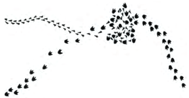

# Science
{: .no_toc }
The question of the day is, "What is science?".

Where does it fit, why does it exist, why do you have an entire class about it in school, how is it useful for the rest of your life?

So give it a shot

_In your lab notebook: With your group, come up with a definition of science._
{: .fs-6 .fw-300 .text-blue-000}

---
<!-- table of contents for the page -->
## Table of contents
{: .no_toc .text-delta }

1. TOC
{:toc}

---
## Observation and Inference
[Observation](https://translate.google.com/#view=home&op=translate&sl=en&tl=es&text=observation){: .btn .btn-outline } means to look at the world around you, what do you see.
[Inference](https://translate.google.com/#view=home&op=translate&sl=en&tl=es&text=inference){: .btn .btn-outline } means to take what you see and make a guess.
It is a lot like how gossip works, when you see someone else do something, you then make up a reason for why they are doing it.
The gossip is making and inference.

### Activity 1 $$\approx$$ 5 minutes
{: .no_toc}
Practice making observations and inferences by writing out the chart below either in your lab notebook or on a blank sheet of paper, or [there is a handout](./Images/observation_inferences/observation_inferences.pdf){: .btn .btn-outline } that can be printed.

First come up with 10 observations either about the room or something else you have seen recently.
Then, come up with your inference.
Next, fold the paper so that your inference is covered up and you can only see the observation and your partners inference

|    | Observation | Your inference | Partners Inference |
| -- |-------------|----------------|--------------------|
|    | The ground is wet | It must have rained last night. | They must have watered the yard last night. |
| 1 | | | |
| 2 | | | |
| 3 | | | |
| 4 | | | |
| 5 | | | |
| 6 | | | |
| 7 | | | |
| 8 | | | |
| 9 | | | |
| 10 | | | |

When you are both done, compare your inference with your partner and talk about the differences.

### Activity 2 $$\approx$$ 5 minutes
{: .no_toc}
Look at the image below and write up a story based on it.

When you are done, compare your story with those in your group.

### Reflection Question
{: .no_toc}

_In your lab notebook: Why do you think you and your partners did not agree on either your inferences or story about the tracks?_
{: .fs-6 .fw-300 .text-blue-000}

## Models
The simplest way to

Test link.

[Forces Lab](/units/1 mechanics/resources/forces.doc)

## Units

## References
{: .no_toc}

The activites and demonstrations were inspired by Process of Science kit from Perimeter Institute.
