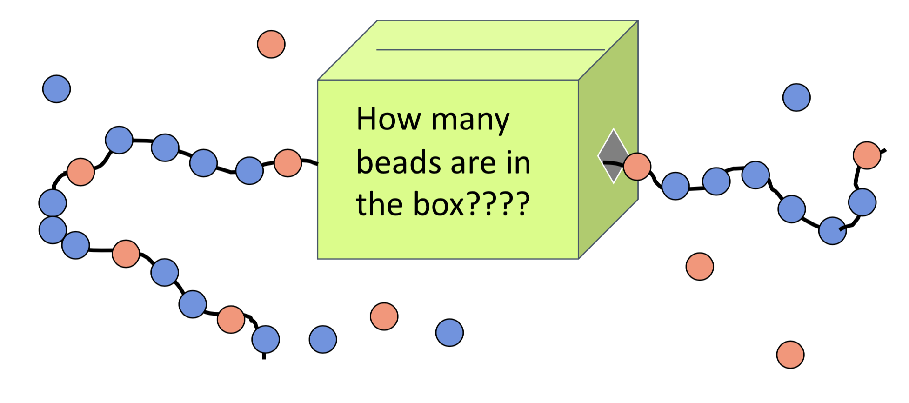

# Nature of Science - Uncertainty and Bias
{: .no_toc }
Science is modeling, we covered that.
The question now is how do we figure out what is a 'good' model, how do we 
[evaluate](https://translate.google.com/#view=home&op=translate&sl=en&tl=es&text=evaluate){ :btn :btn-outline } our models?

_In science you have heard the terms 'theory' and 'law'. Examples are 'Theory of Relativity' and 'Newton's 2nd Law'.  In your lab notebook, explain what you think the difference between a theory and a law is.  Provide examples if possible._
{: .fs-6 .fw-300 .text-blue-000} 

<!-- table of contents for the page -->
## Table of contents
{: .no_toc .text-delta }

1. TOC
{:toc}

---
# Uncertainty in Science
Here is the short version, in science *NO* model is perfect.
There are two main reasons for this:

  * We cannot collect enough information to [prove](https://translate.google.com/#view=home&op=translate&sl=en&tl=es&text=prove){ :btn :btn-outline} with absolute certainty something
  * Scientists assume that they do not and cannot know everything (the word for this is [humble](https://translate.google.com/#view=home&op=translate&sl=en&tl=es&text=humble){: .btn .btn-outline })

[Uncertainty](https://translate.google.com/#view=home&op=translate&sl=en&tl=es&text=uncertainty){: .btn .btn-outline } covers both reasons.
The question then is, how do we account for uncertainty?

## Italian Flag Analysis
This is the Italian flag:

It has a green, white, and red strip.
This is a great way to analyze models.
Green is evidence for the model,
red is evidence against the model,
and the white is for things we do not know (uncertain about).

## Activity - Beads in the box
Practice using the Italian flag analysis.
Look at the picture below and come up with a answer for how many beads are in the box and...

_In your lab notebook make an Italian flag analysis of your answer to 'how many beads are in the box?'  Either work in groups, or after you have an idea, share with each other to build out your flag._
{: .fs-6 .fw-300 .text-blue-000}

# Bank Statements Activity
Time to play detective.
Your group will receive an envelop of bank statements.
Each bank statement has a some of the places, and amounts, that some un-known people spent.
Your mission, is to come up with a theory for what is going on in these peoples lives.

##  Procedure
There are three rounds.
Each round you will pull some bank statements out of the envelope at random.
You will then come up with or revise your theory for what is happening to these people.
You will then do an Italian flag analysis of your theory using your bank statements.

  * 1st round - pull out 3 statements
  * 2nd round - pull out 2 statements
  * 3rd round - pull out 2 statements

## Discussion
  * How did your theories change over the three rounds?
  * How certain are you of your theory? (look at your Italian flags)
  * How does your theory compare to other groups that have the same set of statements?

# Bias in Science
[Bias](https://translate.google.com/#view=home&op=translate&sl=en&tl=es&text=bias){: .btn .btn-outline}
is how you interpret things differently than other people.
Bias happens because _everyone_ has different experiences that shape their understanding of the world around them.

_In your lab notebook compare how you think bias played a part in the different theories groups came up with._
{: .fs-6 .fw-300 .text-blue-000}

Now let us look at bias in science.
Close your eyes and think of a scientist, describe the person you see in your lab notebook.
_Finish this sentence in your lab notebook:  When I think of a scientist I picture ..._
{: .fs-6 .fw-300 .text-blue-000}

Now examine the bias's your imaginary scientist has.
_List 5 things that you think matter to your scientist, list 5 things that matter to YOU._
{: .fs-6 .fw-300 .text-blue-000}

## Gaps in Science
There are two big problems with science.
  
  * English is the language of science, most research that is not written in english, is unknown to the rest of the world.
  * Historically, most science in English was done and written by white males.

This means that there is a big bias in science towards the concerns of english-speaking white males.
An example is medicine.
Most medicines are designed for, and only tested on white males.
How it effects women and people of non-Caucasian races, we usually don't know.

_List 5 things matter to YOU that you have never heard of any research being done on, think of medicine, social problems, regional problems, etc._
{: .fs-6 .fw-300 .text-blue-000}

# Exit Ticket and Reflection
On the sticky note provided, answer the following and post it on the board as you leave.

_What is one way that your unique view is important to this class._
{: .fs-6 .text-blue-000}

Reflection.

_Make a list in your lab notebook of 10 things that make up who you are and create the bias you see the world.  Considering those 10 things, if you could research anything in the world, what would it be and why?_

# References
  * Hubenthal, Michael, and Mike Gallagher. “NSTA 2019.” NSTA, Accounting for Uncertainty in Scientific Argumentation, 2019.

# Prep
  * Bank statements envelopes
  * 
w
