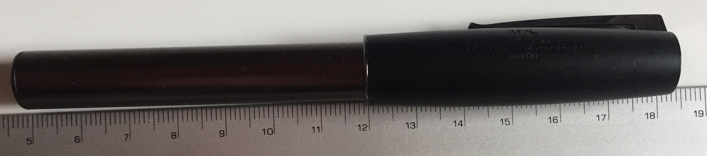
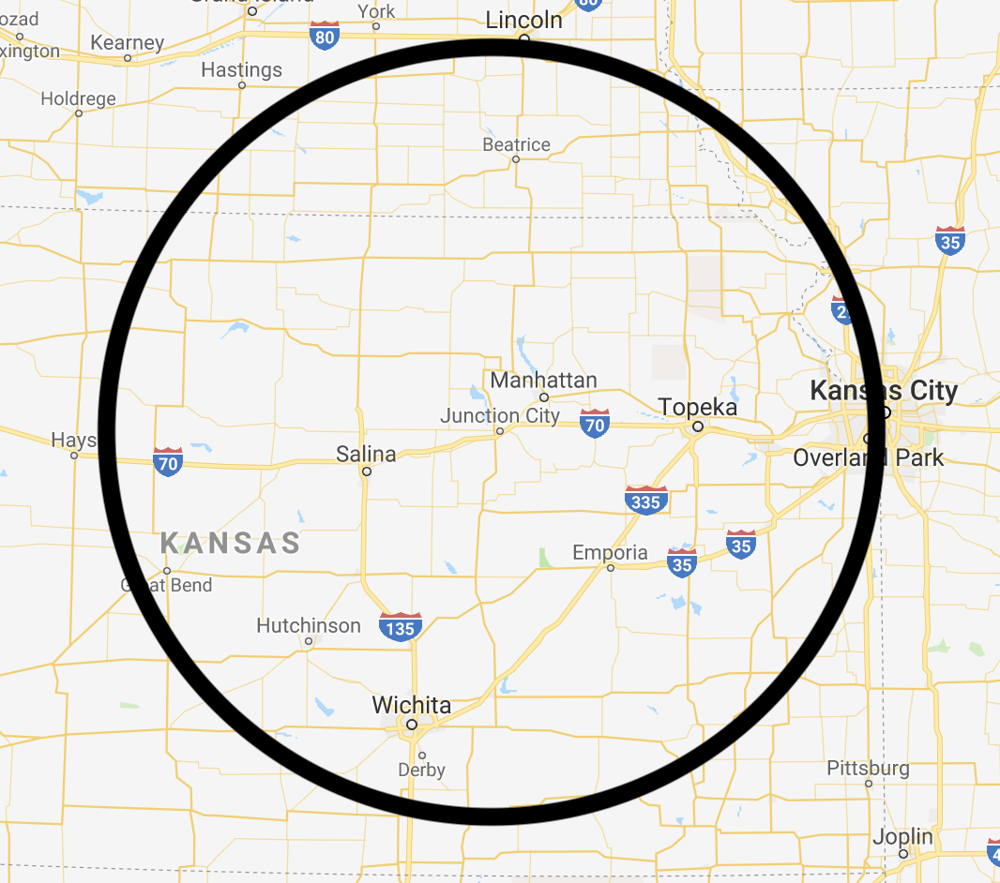
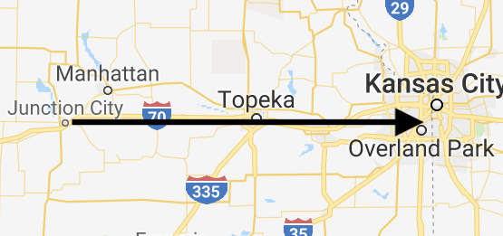

# Describing Motion
{: .no_toc }

<!-- table of contents for the page -->
## Table of contents
{: .no_toc .text-delta }

1. TOC
{:toc}

---
# Units
Motion is described by combinations of length (meters) and time (seconds).

`Distance` is how far apart two things are and is measured in meters.
In math you will learn how to calculate the distance between any two points.
For this class we will stick to simple distances.

`Speed` and `velocity` both describe how fast something is going and have the units

$$\frac{ \text{meters} }{ \text{second} } = \frac{m}{s}$$

'Acceleration' describes how fast something velocity is changing and has the units:

$$\frac{ \text{meters} }{ \text{seconds squared} } = \frac{m}{s^2}$$

# Distance
`Distance` is how far something is.
So you have an idea of distances here are some common ones.

  * If you stretch out your arm, the distance from your nose to the end of your fingers is 1 meter.
  * The width of the nail on your pointer finger is about 1cm.

If an object is moving and you want to track the distance it is covering, you do the following:

$$\text{Distance} = \text{Current Position} - \text{Previous Position}$$

This is short handed by using the Greek symbol delta, or $\delta$, which means 'change in'.
Everytime you see the symbol $\delta$ you should immediately replace it with 'change in' in your head.
Using our new symbol distance becomes:

$$\text{Distance} = \delta\text{Position}$$

Look at the picture below.
The pen is 13cm long because 18cm - 5cm is 13cm.

<figure>

<figcaption>Measuring the distance from one end of a pen to the other.</figcaption>
</figure>

Normally we make our lives easier and line the zero up with one side, but that is not always possible.

# Vector
A `vector` is both a distance and a direction, usually represented by an arrow.
To explain the difference between direction and a vector, consider my weekend trip.

This weekend I'm going to Ikea in Kansas City.
It is 200 km away.
If you tell a friend that Kansas City is 200 km away, they have a lot of options.

<figure>

<figcaption>
    A map with a ring showing all of the places that are 200km from Junction City.
</figcaption>
</figure>

To fix this problem when we say that Kansas City is 200km away, we also have to say in which direction, East.

<figure>

<figcaption>
    A map with an arrow pointing east to Kansas City.  The length is 200km.
</figcaption>
</figure>

When you specify the direction of a distance it becomes a `vector`.
A `vector` is simply a direction that also has a direction associated with it.

You can also get vectors using the $\delta$ symbol that we used for distance earlier.
But that is is more complicated and will be put at the end for those over-achievers out there.

# Speed and Velocity
`Speed` is just a distance divided by a time.
`velocity` is just a vector divided by time.

$$\text{Speed} = \frac{\text{Distance}}{\text{Time}}$$
$$\text{Velocity} = \frac{\text{Vector}}{\text{Time}}$$

A couple of good speeds to remember are:

  * Walking speed is about 1 m/s.
  * The fastest people can run about 10 m/s.
  * Driving down I-70 is 120 km/hr.

Back to my weekend trip.
Ikea is 200 km away AND it will take me two hours to get there.
To calculate the speed we just need the distance.

$$\text{Speed} = \frac{\text{Distance}}{\text{Time}} = \frac{200 km}{2 hr} = 100\frac{km}{hr}$$

But to calcuate the velocity we need a vector, so let's rephrase where Ikea is.
Ikea is 200 km East of Junction City AND it will take me two hours to get there.
Now we can calculate the velocity.

$$\text{Velocity} = \frac{\text{Vector}}{\text{Time}} = \frac{200 km East}{2 hr} = 100\frac{km}{hr}\text{ East}$$

These are both called ***average*** speed, and ***average*** velocity.
This is because they are the average speed we drove over the whole time.
When I go to Kansas City I usually make one stop, so there is a period of time that I'm not moving.
The rest of the time I'm usually moving along quite fast, 120 km/hr.
When you ***average*** out the time I was not moving with the time I was, you get the 100 km/hr that we calculated.

If you want to calculate instantaneous speed and velocity, well check at the end.
We'll talk more about $\delta$ and instantaneous measurments then.

# Acceleration
Speed and velocity looked at how a distance or vector changed in time.
Acceleration looks at how a speed or velocity changes in time.

The most common acceleration by far is gravity.

  * The acceleration due to gravity is 10 $\frac{m}{s^2}$

First let's look at acceleration as the change in speed divided by the change in time.

$$\text{Acceleration} = \frac{\text{Change in Speed}}{\text{Change in Time}} = \frac{\delta\text{Speed}}{\delta\text{Time}}$$

My car is amazing, if I push the gas peddal all the way to the floor when I am headed down the entrance ramp it takes 7.0 seconds to reach 28 m/s (62 mph).
That means that the acceleration of my car is:

$$\text{Accleration} = \frac{28 m/s}{7.0 s} = 4 \frac{m}{s^2}$$

However, my care is even better at stopping!
It only takes 3.3 seconds to stop from 31.3 m/s, so

$$\text{Accleration} = \frac{-31.3 m/s}{3.3 s} = -9.5 \frac{m}{s^2}$$

What is the difference between the two answers?

  * When accelerating the number was positive
  * When slowing down (deccelerating) the number was negative

In physics, if something is getting faster, it has a positive acceleration, if something is getting slower, it has a negative acceleration.

# Add 
{: .no_toc}

** to do **
  * talk about how with velocity there is one other thing, changing direction
  * talk about which of the three we can feel.

## Position vs Time Graphs
{: .no_toc}
  * show examples of position versus time and how to calculate distance, velocity, and acceleration (well you can't calculate acceleration, but you can recognize when it is happening.)

## Instantaneous Velocity and Acceleration
{: .no_toc}
  * Explain how the change in  can mean a long time, or a short time.  The shorter the time, the more instantaneous the velocity is.
