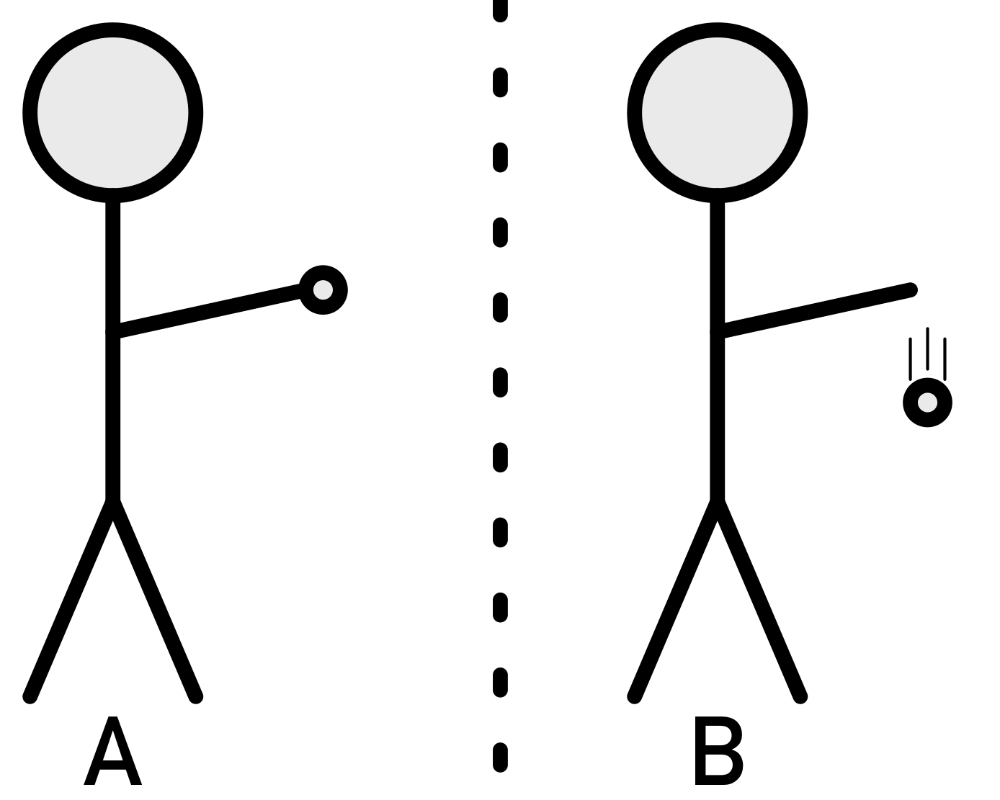

# Forces
{: .no_toc }
The two most famous equations of physics are $$F=ma$$ and $$E=mc^2$$.
Today we learn about $$F=ma$$, also known as, Newton's 2nd Law of Motion.

Newton's 3 laws of motion describe how objects move.

  * 1st Law - Inertia - says objects won't change their motion for no reason.
  * 2nd Law - Forces - gives the reason, and equation, for when and how objects motion changes.
  * 3rd Law - Equal and opposite - states what happens when two objects run into each other.

 _In your lab notebook: come up with 3 examples for each of the three laws._
 {: .fs-6 .fw-300 .text-blue-000} 

<!-- table of contents for the page -->
## Table of contents
{: .no_toc .text-delta }

1. TOC
{:toc}

---
# Forces
A force is anything that causes something to move or change its current motion.
The unit is a Newton (N), named for Issac Newton (the guy that had an apple fall on his head).

You probably know and love Newton's 2nd Law (N2L) as force equals mass times acceleration $$F=ma$$.
That is only partly right.

It is much more right to say that N2L is 'the SUM of all forces is equal to mass times acceleration':

$$\sum F=ma$$

The $$\sum$$ is the greek letter sigma, and means 'sum of all' in math-speak.

This means that ALL forces must be accounted for, not just one force.

There are only 3 parts to the equation; sum of all forces, mass, and acceleration.
Mass is usually constant, so the only two parts that need examined are the sum of all forces and acceleration.

# Sum of all Forces
So, what is the difference you ask?
Well compare parts A and B in the image below.

<figure>

<figcaption>Demonstration of sum of all forces.</figcaption>
</figure>

In picture A, the ball is not moving because the sum of all the forces is zero.
The hand is holding the ball with enough force to oppose gravity, canceling out the force of gravity.

In picture B, the ball is falling because the only force acting on the ball is gravity, and with no other force acting on it, it falls.

# Acceleration
Acceleration is a change in motion, and most easily understood comparing when something is accelerating, and when something is not.

| Something IS accelerating if... | Something is NOT accelerating if.. |
|---------------------------------|------------------------------------|
| Its speed is changing           | Moving at a constant velocity      |
| Its direction is changing       | Not moving at all                  |

Note how something is NOT acclerating it is obeying Newton's 1st law?
How about that when something IS accelerating its velocity is changing (remember velocity is the combination of speed AND direction)?

# Activity - Newton's 2nd Law
[Link to the lab handout](./images/39 Newton's 2nd Law.doc){: .btn .btn-outline}

