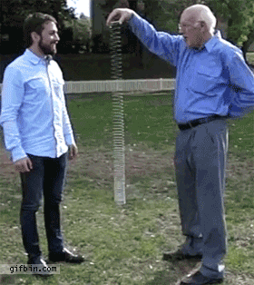

# Waves - Description
{: .no_toc }
Waves are things that wiggle.
Everything from wiggling a string to large crowds in stadiums, to the sound that you hear, to the light that is bringing this website too you.

EQ - _What makes a wave, a wave?_
{: .fs-6 .fw-300 .text-blue-000} 

Know - _In this case, the essential question_
{: .fs-6 .fw-300 .text-blue-000} 

Do - _Wave properties activity, draw pictures and write descriptions._
{: .fs-6 .fw-300 .text-blue-000}

## Instructions
{: .no_toc}
For each of the following activities, you should:
  - [ ] Draw a picture of what it looks like
  - [ ] Describe the picture you drew

You are going to be graded on if you have a large, clear picture, and a description in your own words descrbing what is happening.

<!-- table of contents for the page -->
## Table of contents
{: .no_toc .text-delta }

1. TOC
{:toc}

---
# Rope Demonstration
Watch the demonstration given by your teacher and answer the following questions:
<label class="tasks-list-item">
  <input type="checkbox" class="tasks-list-cb">
  
  
    Draw a picture of what it looks like
  
</label>
<label class="tasks-list-item">
  <input type="checkbox" class="tasks-list-cb">
  
  
    Describe the picture you drew
  
</label>

Answer the following quesitons:
{:start="3"}
<label class="tasks-list-item">
  <input type="checkbox" class="tasks-list-cb">
  
  
    Which way does the wave move?
  
</label>
<label class="tasks-list-item">
  <input type="checkbox" class="tasks-list-cb">
  
  
    Describe how the hand movement is related to the wave movment.
  
</label>
<label class="tasks-list-item">
  <input type="checkbox" class="tasks-list-cb">
  
  
    Where does the energy for the wave come from?
  
</label>

# String Waves
Tape a piece of red yarn to the desk or table top.
Now, with your hand you can wiggle the yarn back and forth.
This makes a wave.
If you stop moving your arm, the yarn will stop moving and stay in the shape that it was last in.
Do this a couple of times, so that you can see how to 'start' and 'stop' and 'capture' a wave.

## First Wave
Okay, now make a nice and pretty wave with your yarn and stop.
<label class="tasks-list-item">
  <input type="checkbox" class="tasks-list-cb">
  
  
    Draw a picture of what your wave looks like
  
</label>
<label class="tasks-list-item">
  <input type="checkbox" class="tasks-list-cb">
  
  
    Describe what your wave looks like, what properties can you define.
  
</label>

## Second Wave
Now, make a new wave.
**BUT**, this time move your are faster, meaning wiggle the string more vigorously, so you have a different wave.
<label class="tasks-list-item">
  <input type="checkbox" class="tasks-list-cb">
  
  
    Draw a picture of what your wave looks like
  
</label>
<label class="tasks-list-item">
  <input type="checkbox" class="tasks-list-cb">
  
  
    Describe what your wave looks like, what properties can you define.
  
</label>
<label class="tasks-list-item">
  <input type="checkbox" class="tasks-list-cb">
  
  
    How does this one differ from the last wave, describe at least 2 differences.
  
</label>
<label class="tasks-list-item">
  <input type="checkbox" class="tasks-list-cb">
  
  
    Which was more tiring to make, the first or the second wave? What does that say about the energy in the wave.
  
</label>

# Slinky Waves - Wiggling
Send one group member to the teacher to ask for a slinky.
**YOU MUST RESPECT THE SLINKY**
They are very easily tangled and ruined, and _no-one_ likes a sad tangled slinky.

## Wave 1
Have you and your partner sit or kneel on the floor, each holding the slinky in your hand.
Then one of you can wiggle the slinky just like how the teacher did in the rope demonstration.
Note, this one is a bit harder because you can't just let go and have the slinky stop like the string, so pay attention.
<label class="tasks-list-item">
  <input type="checkbox" class="tasks-list-cb">
  
  
    Draw a picture of what your wave looks like
  
</label>
<label class="tasks-list-item">
  <input type="checkbox" class="tasks-list-cb">
  
  
    Describe what your wave looks like, what properties can you define.
  
</label>

## Wave 2
Pull your slinky tighter.
Repeat the activity.
Now, you are going to probably have to switch back and forth between tighter and looser a couple of times.
Talk it over with your partner what you notice happening as you do so.
<label class="tasks-list-item">
  <input type="checkbox" class="tasks-list-cb">
  
  
    Draw a picture of what your wave looks like
  
</label>
<label class="tasks-list-item">
  <input type="checkbox" class="tasks-list-cb">
  
  
    Describe what your wave looks like, what properties can you define.
  
</label>
<label class="tasks-list-item">
  <input type="checkbox" class="tasks-list-cb">
  
  
    How does this one differ from the last wave, describe at least 2 differences.
  
</label>
<label class="tasks-list-item">
  <input type="checkbox" class="tasks-list-cb">
  
  
    Which was 'faster'.  (I won't tell you what 'faster' means, but just think about what you are seeing.)
  
</label>

# Slinky Waves - Drop
Now for the fun one.

_Question, does a slinky defy gravity?_ 

To test this, get out a cell phone.
Yes you read that right.
Set your phone to record a slow motion video.
Now, the partner not recording the video should hold up the slinky.
Let some of the slinky go so that it is hanging, but hold some of it in your hand still.
This way the slinky is stretched towards the ground.

To spoil it, this is what you are doing.
<figure>

<figcaption>Gif of Veritasium slinky drop.</figcaption>
</figure>

Questions for your lab notebook:
<label class="tasks-list-item">
  <input type="checkbox" class="tasks-list-cb">
  
  
    Draw SEVERAL pictures of what slinky looks like as it falls
  
</label>
<label class="tasks-list-item">
  <input type="checkbox" class="tasks-list-cb">
  
  
    Describe what you think is happening
  
</label>
<label class="tasks-list-item">
  <input type="checkbox" class="tasks-list-cb">
  
  
    Here is the tricky question.  Do you think the bottom of the slinky 'knows' when the top was released?  Explain your answer.
  
</label>
<label class="tasks-list-item">
  <input type="checkbox" class="tasks-list-cb">
  
  
    Last and not least, how does this wave compare with your previous waves?  Does it wiggle? Do you even consider it to be a 'wave'?
  
</label>

# Conclusion
Answer the following in your lab notebook in complete sentences.
<label class="tasks-list-item">
  <input type="checkbox" class="tasks-list-cb">
  
  
    How have I behaved in class today?
  
</label>
<label class="tasks-list-item">
  <input type="checkbox" class="tasks-list-cb">
  
  
    How could I better contributed to a positive classroom environment.
  
</label>
<label class="tasks-list-item">
  <input type="checkbox" class="tasks-list-cb">
  
  
    Summarize what you learned today in 1 sentence.
  
</label>
<label class="tasks-list-item">
  <input type="checkbox" class="tasks-list-cb">
  
  
    Answer the days essential question (EQ).
  
</label>

# Prep
For demonstration:
  * A rope

For each group:
  * A piece of yarn
  * A piece of tape
  * A slinky