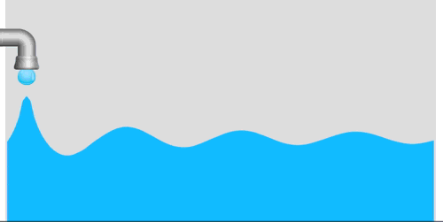
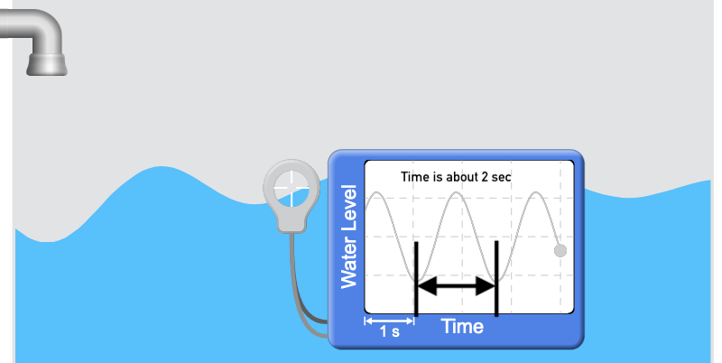
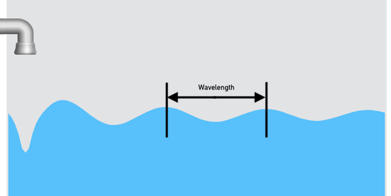
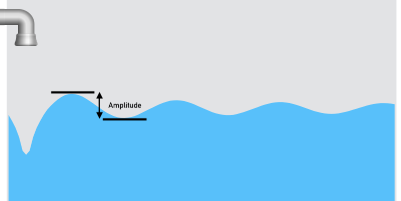

# Waves - Measurements
{: .no_toc }
Last class/page, you described waves using your own words.
You made pictures, and then wrote descriptions.

Now, you get to learn the science words.

EQ - _How do I describe frequency, wavelength, and speed._
{: .fs-6 .fw-300 .text-blue-000} 

Know - _Science definitions of frequency, wavelength, and speed._
{: .fs-6 .fw-300 .text-blue-000} 

Do - _Measure the properties of waves in PHET simulations._
{: .fs-6 .fw-300 .text-blue-000}

## Introduction
{: .no_toc}
  * **Frequency** is how fast the wave wiggles
  * **Wavelength** is how far it is from one part of a wiggle to the same part on the next wiggle.
  * **Amplitude** is how big the wiggle is from its highest point to its lowest point.
  * **Speed** is how fast the wave travels.

## Instructions
{: .no_toc}
Your goal out of today is have an understanding of what _frequency_, _wavelength_, _amplitude_, and _wave speed_ is.

Copy down ___ANY___ and ___ALL___ information that you need in your lab notebook so that you can use _frequency_, _wavelength_, _amplitude_, and _wave speed_ to describe waves.

---
<!-- table of contents for the page -->
## Table of contents
{: .no_toc .text-delta }

1. TOC
{:toc}

---

# Vocabulary - Definitions and Examples
Turns out there are only 4 things required to describe a wave.
Frequency, wavelength, amplitude, and speed.

<figure>

<figcaption>Example of w water wave.</figcaption>
</figure>

| Property | Definition | Symbol | Unit |
|:----------:|:-------------------------------------------------------------------------:|:-----------:|-----------------------------------|
| Frequency | $$\text{Frequency} = \frac{\text{# of wiggles}}{\text{Time in seconds}}$$ | f | Hertz - Hz - $$\frac{1}{second}$$ |
| Wavelength | Length from one point on a wave to the same point on the next wave | $$\lambda$$ | meters |
| Amplitude | Height from the highest part to the lowest part | A | Depends on the wave... |
| Speed | Speed is the frequency times the wavelength | c | $$\frac{m}{s}$$ |

## Frequency - f
Frequency, is how many times the wave wiggles in a given period of time.

$$\text{Frequency} = \frac{\text{# of wiggles}}{\text{Time in seconds}}$$

The units are are then just $$\text{Hz}=\frac{1}{\text{s}}$$

To measure frequency there are two ways to do it depending on the picture you have.

### Graph with time on the x-axis
If you have a graph of a wave with time on the x-axis.  The frequency is:

$$\frac{1}{\text{the time from one peak of the wave to the next peak}}$$

<figure>

<figcaption>Frequency measurement example.  The one wiggle took about 2 seconds, so the frquency is 0.5 Hz.</figcaption>
</figure>

### Video or moving picture
Simply count the number of high (or low) points that pass in a given point in time.
Look at the video below.
There is about 1 wiggle every 2 seconds, so the frequency is:

$$f=\frac{\text{1 wiggle}}{\text{2 seconds}}=0.5 Hz$$

<figure>

<figcaption>Frequency measurement example.  The frequency is about 1 wave per 2 seconds, so 0.5 Hz.</figcaption>
</figure>

## Wavelength - $$\lambda$$
First things first, $$\lambda$$ (pronounced lamb-da, the greek letter L), is the symbol used for wavelength.

To measure the wavelength just take a ruler and measure from one point to the same point on the next wave.
The easiest is usually to go from one peak to another peak.

<figure>

<figcaption>Wavelength as measured from one peak to the next.</figcaption>
</figure>

## Amplitude
To measure the amplitude, all you have to do is figure out the distance from the top to of one peak, to the next lowest.
For the units, you'll have to look at the y-axis.

<figure>

<figcaption>Amplitude of a wave.</figcaption>
</figure>

## Speed
Wave speed is just the product of frequency and wavelength and represents how fast the wave is moving.
Think of a surfer on a wave, the speed the surfer is moving, is the speed of the wave.

<figure>

<figcaption>Wave speed - see how each peak moves away from the dripping faucet.</figcaption>
</figure>

## Wave Equation
And now, we have the wave equation:

$$\text{Wave speed} = \text{Frequency}\times\text{Wavelength}$$

$$c = f \times \lambda$$

# Activity - Waves on a string
By now you should have played with the yarn on the table.
Where it was hard to measure things accurately with yarn on a table, you can measure things really well on a computer that has a pause button.

<iframe src="https://phet.colorado.edu/sims/html/wave-on-a-string/latest/wave-on-a-string_en.html" width="800" height="600" scrolling="no" allowfullscreen></iframe>

1. Setup
  * Mess with the damping and the tension sliders that are at the bottom of the simulation until the string behaves like the yarn did.  
  _You don't have to know what they do, but you should be able to get it close._
  * Once you have it looking right, switch from the 'manual' to the 'oscillate' in the selection box in the top left.
  This will allow you to pause it easily for your measurements.
2. Start the oscillator and then pause it.
<label class="tasks-list-item">
  <input type="checkbox" class="tasks-list-cb">
  
  
    Record the frequency and wavelength.
    _You'll have to click on the 'rulers' in the lower right to display the rulers._
  
</label>
3. Change the frequency, restart the oscillator, wait a bit, then pause it again.
<label class="tasks-list-item">
  <input type="checkbox" class="tasks-list-cb">
  
  
    Record the frequency and wavelength.
  
</label>
4. Change the frequency, restart the oscillator, wait a bit, then pause it again.
<label class="tasks-list-item">
  <input type="checkbox" class="tasks-list-cb">
  
  
    Record the frequency and wavelength.
  
</label>
5. You now have everything that you need to calculate speed!
<label class="tasks-list-item">
  <input type="checkbox" class="tasks-list-cb">
  
  
    Calculate the speed for each of the 3 frequency-wavelengths you measured.
  
6. Now that you have some speeds, compare them!
<label class="tasks-list-item">
  <input type="checkbox" class="tasks-list-cb">
  
  
    What do you notice about your 3 wave speeds?
  
</label>
7. Change the tension to make it lower.
<label class="tasks-list-item">
  <input type="checkbox" class="tasks-list-cb">
  
  
    Record the frequency and wavelength, and calculate the speed for your new wave.
  
</label>
8. Since you changed something, another comparison is in order!
<label class="tasks-list-item">
  <input type="checkbox" class="tasks-list-cb">
  
  
    How does the speed compare with the first 3 you measured?
  
</label>
9. One more question,
<label class="tasks-list-item">
  <input type="checkbox" class="tasks-list-cb">
  
  
    What changed?
  
</label>

# Water, Sound, and Light waves
Here is the deal, you are very familiar with waves on water, kind of familiar with sound as waves, and probably not at all used to thinking of light as waves.
In the following questions, you'll be guided into deeper unknowns little by little, so stick with us!

<iframe src="https://phet.colorado.edu/sims/html/waves-intro/latest/waves-intro_en.html" width="800" height="600" scrolling="no" allowfullscreen></iframe>

## Water waves
1. Setup
  * Start with the 'Water'
  * Click on the 'Side View' in the lower left.
  * Click the 'green button' on the spout to start it dripping.
2. Calculate the frequency
  * Pull the timer out of the tool box on in the upper right.
  * When a drop comes out, click start.
  * Stop the timer when the 10th drop comes out.
<label class="tasks-list-item">
  <input type="checkbox" class="tasks-list-cb">
  
  
    Record the number of drops, the time it took into your lab notebook.
  
</label>
  * To calculate the frequency, divide the number of drops by the time it took.
<label class="tasks-list-item">
  <input type="checkbox" class="tasks-list-cb">
  
  
    Record the frequency in your lab notebook.
  
</label>
3. Measure the wavelength
  * Pause the simulation by pressing the 'pause' button.
  * Pull the tape measure out of the tool box.
  _The tape measure measures from the little '+' sign to the other little '+' sign._
<label class="tasks-list-item">
  <input type="checkbox" class="tasks-list-cb">
  
  
    Record the wavelength in your lab notebook.
  
</label>
4. Repeat steps 2 and 3 for a different frequency
<label class="tasks-list-item">
  <input type="checkbox" class="tasks-list-cb">
  
  
    Record the number of drops, time it takes, calculated frequency, and wavelength in your notebook.
  
</label>
5. Now time for the speed.
<label class="tasks-list-item">
  <input type="checkbox" class="tasks-list-cb">
  
  
    Calculate the speed for each of your 3 frequency-wavelength pairs.  Record them in your lab notebook.
  
6. Now that you have the speeds, time for the comparison.
<label class="tasks-list-item">
  <input type="checkbox" class="tasks-list-cb">
  
  
    When you compare the wave speeds, what do you notice?
  
</label>
7. Side versus top view - Switch back and forth between the top and side view.
<label class="tasks-list-item">
  <input type="checkbox" class="tasks-list-cb">
  
  
    Compare and contrast the side and top view.
  
</label>

## Sound Waves
1. Click the green button on the speaker to start the sound waves.
2. Comparison time!
<label class="tasks-list-item">
  <input type="checkbox" class="tasks-list-cb">
  
  
    Compare and contrast the side, top view of the sound with the side and top views of the water.
  
3. Click the 'Play tone' box over on the right hand side just below the sliders.
  * Slide the frequency down to 'min'
<label class="tasks-list-item">
  <input type="checkbox" class="tasks-list-cb">
  
  
    Describe what the tone sounds like.
  
</label>
  * Slide the frequency up to 'max'
<label class="tasks-list-item">
  <input type="checkbox" class="tasks-list-cb">
  
  
    Describe what the tone sounds like.
  
</label>
<label class="tasks-list-item">
  <input type="checkbox" class="tasks-list-cb">
  
  
    Compare the two frequencies.
  
</label>
4. Measuring the frequency, wavelength, speed for 'min'
  * Set the frequency to 'min'
  * Get out the timer from the toolbox.
  * When a bright white spot appears at the speaker, start the timer.
  * With the timer running, count up 10 white spots, stopping the timer when the 10th spot appears.
<label class="tasks-list-item">
  <input type="checkbox" class="tasks-list-cb">
  
  
    Record the number of white spots, the time it took, and then divide them and multiply by 1000 to get the frequency.
  
</label>
  * _You multiply by a 1000 because the timer is in ms so that you can 'see' the sound wave.  Sound waves are much, much, to fast to see so this simulation slows them down by a factor of a 1000._
  * Once you have measured your frequency, you can now measure the wavelength.
  * Let the screen fill with sound waves, and then press pause.
  * Get the tape measure out of the toolbox.
<label class="tasks-list-item">
  <input type="checkbox" class="tasks-list-cb">
  
  
    Measure and record the wavelength, make sure to convert the length to meters.
  
</label>
  * _For this, the wavelength is either one bright spot to the next bright spot, or one dark spot to the next dark spot._
<label class="tasks-list-item">
  <input type="checkbox" class="tasks-list-cb">
  
  
    Multiply the frequency and wavelength to get the wave speed.
  
</label>
5. Repeat Step 4 with the 'max' frequency.
<label class="tasks-list-item">
  <input type="checkbox" class="tasks-list-cb">
  
  
    Measure the frequency, wavelength, and speed for the 'max' frequency.
  
</label>
6. And, at last for the comparison:
<label class="tasks-list-item">
  <input type="checkbox" class="tasks-list-cb">
  
  
    Compare and contrast the frequency, wavelength, and speed for the 'min' and 'max' frequencies.
  

## Light
For this, you are going to repeat the measurement steps that you did for sound to get the frequency, wavelength, and speed for three different colors.
_Note, to calculate the frequency you'll need to take the number of colored spots, divided by the time it took, times $$10^{15}$$ because the timer is in femto-seconds.  Yes, light is that much faster than sound._

<label class="tasks-list-item">
  <input type="checkbox" class="tasks-list-cb">
  
  
    Copy the following table into your lab notebook.
  
</label>

| Data | Color 1 | Color 2 | Color 3 |
|---------------------------------------------------------------|---------|---------|---------|
| Color Name |  |  |  |
| # of spots | 10 | 10 | 10 |
| Time it took in fs |  |  |  |
| Frequency (number of spots, divided by time, times $$10^{15}$$) |  |  |  |
| Wavelength in nm (what the ruler reads) |  |  |  |
| Wavelength in m |  |  |  |
| Speed of the wave (frequency $$\times$$ wavelength) |  |  |  |

<label class="tasks-list-item">
  <input type="checkbox" class="tasks-list-cb">
  
  
    Pick a color and measure the time (in fs) for 10 spots, and then measure the wavelength with the ruler, fill the values into the table.
  
</label>
<label class="tasks-list-item">
  <input type="checkbox" class="tasks-list-cb">
  
  
    Repeat for a 2nd color.
  
</label>
<label class="tasks-list-item">
  <input type="checkbox" class="tasks-list-cb">
  
  
    Repeat for a 3rd color.
  
</label>
<label class="tasks-list-item">
  <input type="checkbox" class="tasks-list-cb">
  
  
    Compare and contrast the results for the different colors.
  
</label>

# Conclusion
Answer the following in your lab notebook in complete sentences.
<label class="tasks-list-item">
  <input type="checkbox" class="tasks-list-cb">
  
  
    How have I behaved in class today?
  
</label>
<label class="tasks-list-item">
  <input type="checkbox" class="tasks-list-cb">
  
  
    How could I better contributed to a positive classroom environment.
  
</label>
<label class="tasks-list-item">
  <input type="checkbox" class="tasks-list-cb">
  
  
    Summarize what you learned today in 1 sentence.
  
</label>
<label class="tasks-list-item">
  <input type="checkbox" class="tasks-list-cb">
  
  
    Answer the days essential question (EQ).
  
</label>

# Prep
  * None, all work is done through PHET simulations.
