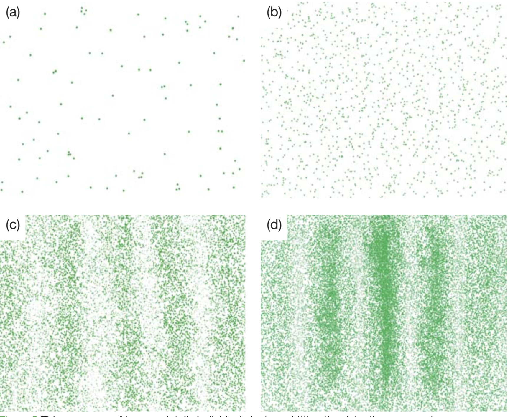

# What is Light?
{: .no_toc }
This is where we take you to the leading edge of physics.
Do not be afraid though, today just shows you that we really don't _know_ everything.

Here is the setup, light does some odd things.
  * The photo-electric effect proves that light exists as single packets, or particles.  You know them as photons.
  * However, if you shine light at two slits, or any number of slits, it creates a pattern as if it were a wave.

So the question is, is light a particle, or a wave?

EQ - _What does it mean for a model to be 'right' or 'correct'?_
{: .fs-6 .fw-300 .text-blue-000} 

Know - _The wave and particle model for light._
{: .fs-6 .fw-300 .text-blue-000} 

Do - _The particle and wave model of light experiment._
{: .fs-6 .fw-300 .text-blue-000}

<!-- table of contents for the page -->
## Table of contents
{: .no_toc .text-delta }

1. TOC
{:toc}

---

# The particle model
Imagine that you are throwing things through a hole.
You'll get a patter that spreads out on the other side, depending upon if you actually throw the thing through the hole, and at what angle.

Now if you have two holes, you would just expect to get those two things added up.

## The Video
Watch the following video until you get to the 4:00 minute mark.

When you are done answer the questions about the 
[Particle Model - Tennis balls](https://youtu.be/wihrAjFXg3o?t=156){: .btn .btn-outline}

  * Draw a picture of what the pattern on the wall looks like as the balls are thrown through one slit.
  * Draw a picture of what the pattern looks like if the balls go through both slits.
  * Predict what it would look like if you had two slits.

## The Demonstration
**Get the following supplies:**
  * A cup that has no slits cut in it, that also has some salt in it.
  * A cup that has two slits cut in it.
  * A piece of paper.

**What you are going to do is the following:**
  * Place the cup with the slits on top of the paper to not make a mess.
  * Carefully pour some salt into the cup with the slits, and lightly tap it to make the salt pass through the slits.
  * Carefully lift up the cup with the slits and set it to the side, still on the paper.
  * Answer the questions below:
    * Sketch a profile of the pile of sand. 
    * Does the profile look like what you would expect of salt falling out of a cup? 
  * Carefully pour all of the salt into the intact cup and return your supplies to the front.

## The Photo-electric effect
To be honest, most all videos out there are too confusing for our purposes.
So here is the short version.

By early 1900 there was a lot, and we do mean a lot of evidence, that light was a wave.
However, there was one experiment that was a hold out.
The photo-electric effect.
It is how solar cells work today, but it boils down to you can shine light on metals electrons come flying off.
That may seem all well and good, but the problem was if you send in a really dim light, you can watch the electrons fly off one at a time.
One at a time...
How can a wave only have 'one'.

# The Wave model
## The video
Continue watching the movie from earlier.
Look ahead though at the questions you are going to have to answer.

[Wave behavior](https://youtu.be/wihrAjFXg3o?t=238){: .btn .btn-outline}

**Answer the following questions in your lab notebook**
  * What is interference?
  * Sketch, to the best of your ability, an interference pattern
  * Do you get an interference pattern with a single source of water and two slits?
  * Sketch the result of a inserting a double slit into a path of light.
  * How does the number of bright spots compare to the classical model? (The last section)

## The activity
**Get the following from the front of the room**
  * A pre-prepared piece of cardboard that has the waves attached to it.

Hold the two waves together at the screen.
As you slide back and forth along the screen you can see how the crests will constructively interfere, and the troughs will too.
You'll also see the points where the crests and troughs will cancel out.

**Answer the following in your lab notebook:**
  * Make a sketch of what you would see on the screen.
  Remember, where two peaks interact, you see a bright spot, where two troughs interact, you'll also see a bright spot.  Where you have both a peak and a trough, there will be no light.
  * Now, the tricky question.  If you fired one photon at a time, would you still see this pattern?

# Pulling it all together
Here is a photons being shot through two slits, one at a time.

<figure>
    
<figcaption>Image showing the build up of photons on a screen shot through two slits.</figcaption>
</figure>

**Answer the following in your lab notebook:**
  * Do you see any pattern in (a) and (b) of the image above?
  * Based on (a) and (b) would you say that photons are acting like a particle, or a wave?
  * Do you see any pattern in (c) and (d) of the image above?
  * Based on (c) and (d) in the image above, would you say that the photons are acting like particles or waves?

And this is where modern physics is at.
We do not know what is happening here.
How can sending something through one at a time result in the same pattern as if you assume that there are many particles interacting?!?!?!?
Good luck, there is a Nobel Prize and a $1,000,000 dollars if you figure it out.

# Fun video
Turns out, we can actually record light traveling.
Now, before you go, [watch this](https://www.youtube.com/watch?v=7Ys_yKGNFRQ){: .btn .btn-outline}

# Conclusion
Answer the following in your lab notebook in complete sentences.
  * How have I behaved in class today?
  * How could I better contributed to a positive classroom environment.
  * Summarize what you learned today in 1 sentence.
  * Answer the days essential question (EQ).

# Prep
**For the classical model**
Each group needs:
  * Paper
  * Intact cup
  * Cup with 2 slits
  * Salt

**For the wave particle model**
Each group needs:
  * Printout attached to cardboard
  * Two push-pins
  * two wave portions on transparency

([This is the handouts that need printed](./resources/wave-model.pdf))

# Resources
This activity is largely taken from and based on the 'The Challenge of Quantum Reality' classroom packet developed by the Perimeter Institute.
