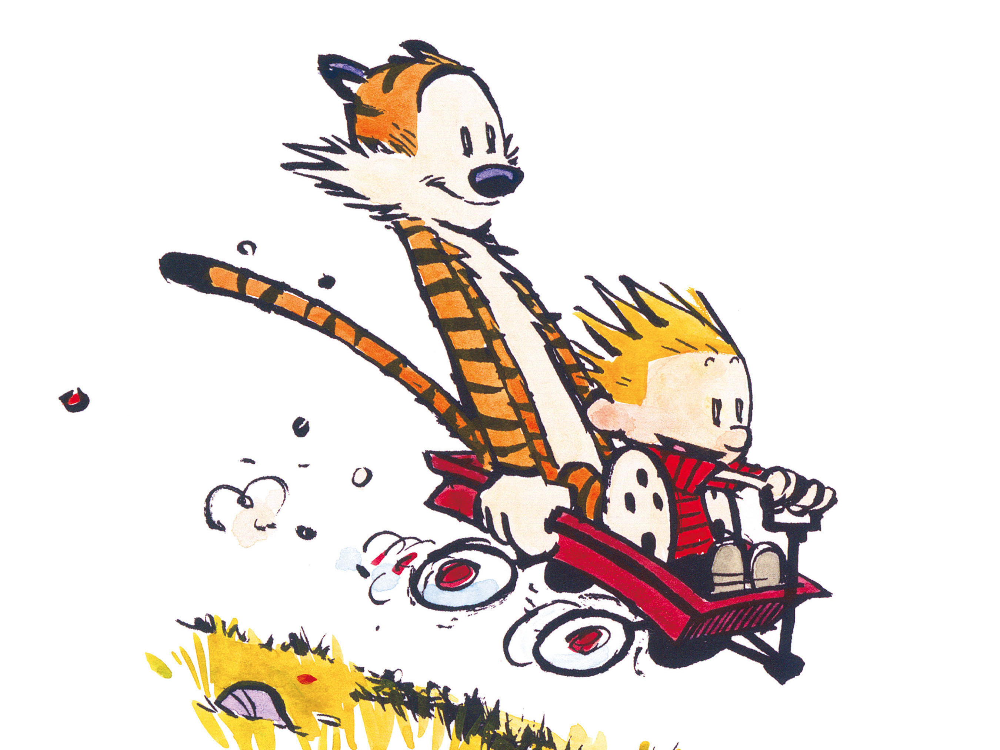

# Absorption
{: .no_toc }
Think of friction.
You know that annoying thing that prevents you from going a thousand miles an hour by the time you get to the bottom of the really big hill.

<figure>

<figcaption>Calvin and Hobbes.</figcaption>
</figure>

The thing is though, can you think of friction with sound?
How about friction in water waves?
How about friction in light?!?!?

Well, there must be be something otherwise sound would travel on forever right?

The truth is, there is some sort of friction in all waves, it is just called absorption.

Absorption is just when some of the wave energy gets converted into something else, usually heat, just like normal friction.

EQ - _What affects absorption of waves?_
{: .fs-6 .fw-300 .text-blue-000} 

Know - _What effects the absorption of sound._
{: .fs-6 .fw-300 .text-blue-000} 

Do - _Make a muffler for a cell phone._
{: .fs-6 .fw-300 .text-blue-000}

## Instructions
{: .no_toc}
You will not be surprised to know that there is more to waves than we have thus covered.
The goal of today is to figure out how frequency and absorption go together.

<!-- table of contents for the page -->
## Table of contents
{: .no_toc .text-delta }

1. TOC
{:toc}

---
# More About Waves
There are somethings we haven't told you yet.
But, you can probably figure them out by now.

There are a couple of things that go in to the properties of a wave (frequency, wavelength, amplitude, and speed).
Think back to the activities you did with waves a couple of classes ago and answer the following:
<label class="tasks-list-item">
  <input type="checkbox" class="tasks-list-cb">
  
  
    What determines the frequency of a wave? _Think back to what determined how fast the yarn wiggled..._
  
</label>
<label class="tasks-list-item">
  <input type="checkbox" class="tasks-list-cb">
  
  
    What determines the amplitude of a wave? _Again, think back to what made the yarn wiggle more..._
  
</label>
<label class="tasks-list-item">
  <input type="checkbox" class="tasks-list-cb">
  
  
    What determines the speed of a wave? _Think back to the lab where you were measuring the speed, what made the speed faster..._
  
</label>

Now, we were being a bit leading, by not asking about the wavelength but here it is.

The frequency AND the amplitude, are both determined by the source, the thing that is making the wave (think of your hand and the yarn).
The speed is determined by the medium (the thing the wave is traveling through) of the wave (think back to what happened when you adjusted the tension in your slinky, or that string simulation.)

The key points are to think about what is the source, and what is medium.

# Absorption Activity
Your goal is to muffle the sound coming out of your phone the best you possibly can, paying attention to how different materials absorb sound differently.

To do this, you are going to systematically test different materials and see what effect they have on the sound your phone is playing.
Now, in your testing you may have to mess around and try different things.

The main focus of this activity is for you to write out descriptions of what you are hearing for the different materials.
Sound you can hear, light you cannot.
But, for your assessment you are going to talk about absorption with light, so you can take what you learn about absorption with sound, and try it with light.

## Observations
**Go and collect the following materials (in a kit) from the front of the room.**
  * Pie tin
  * Styrofoam plate
  * Plastic Cup
  * Felt
  * Cotton balls

<label class="tasks-list-item">
  <input type="checkbox" class="tasks-list-cb">
  
  
    Copy the following table into your lab notebook, you'll fill it out.
  
</label>

| Object | Describe what you did to muffle your speaker | How well did it block low frequencies (bass) | How well did it block high frequencies (treble) |
|-----------------|----------------------------------------------|----------------------------------------------|-------------------------------------------------|
| Styrofoam Plate |  |  |  |
| Plastic Cup |  |  |  |
| Felt |  |  |  |
| Cotton Balls |  |  |  |
| Pie Tin |  |  |  |

## Design your own muffler
Now that you have tried messing with all the different materials, design your own muffler for your phone that will work the best and block all frequencies.

<label class="tasks-list-item">
  <input type="checkbox" class="tasks-list-cb">
  
  
    Draw up a design and explain WHY you think your design will be best.
  
</label>
<label class="tasks-list-item">
  <input type="checkbox" class="tasks-list-cb">
  
  
    Make your design.
  
</label>

Once you have made and tested your design, answer the following questions:
<label class="tasks-list-item">
  <input type="checkbox" class="tasks-list-cb">
  
  
    In what ways did your design work as intended?
  
</label>
<label class="tasks-list-item">
  <input type="checkbox" class="tasks-list-cb">
  
  
    In what ways did it work as intended or not work as intended?
  
</label>
<label class="tasks-list-item">
  <input type="checkbox" class="tasks-list-cb">
  
  
    Did different materials absorb different frequencies?
    Describe what frequencies each material absorbed, high vs low.
  
</label>
<label class="tasks-list-item">
  <input type="checkbox" class="tasks-list-cb">
  
  
    Could you make a better muffler if you think of frequencies?  If so, try it! If not, explain why.
  
</label>

# Conclusion
Answer the following in your lab notebook in complete sentences.
<label class="tasks-list-item">
  <input type="checkbox" class="tasks-list-cb">
  
  
    How have I behaved in class today?
  
</label>
<label class="tasks-list-item">
  <input type="checkbox" class="tasks-list-cb">
  
  
    How could I better contributed to a positive classroom environment.
  
</label>
<label class="tasks-list-item">
  <input type="checkbox" class="tasks-list-cb">
  
  
    Summarize what you learned today in 1 sentence.
  
</label>
<label class="tasks-list-item">
  <input type="checkbox" class="tasks-list-cb">
  
  
    Answer the days essential question (EQ).
  
</label>

# Prep
**Have the following kit for each group**
  * Pie tin
  * Styrofoam plate
  * Plastic Cup
  * Felt
  * Cotton balls

