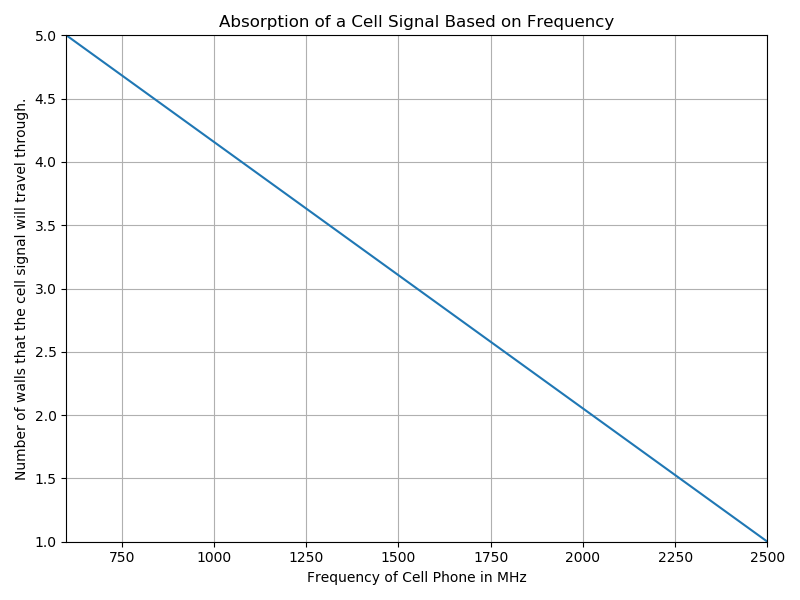
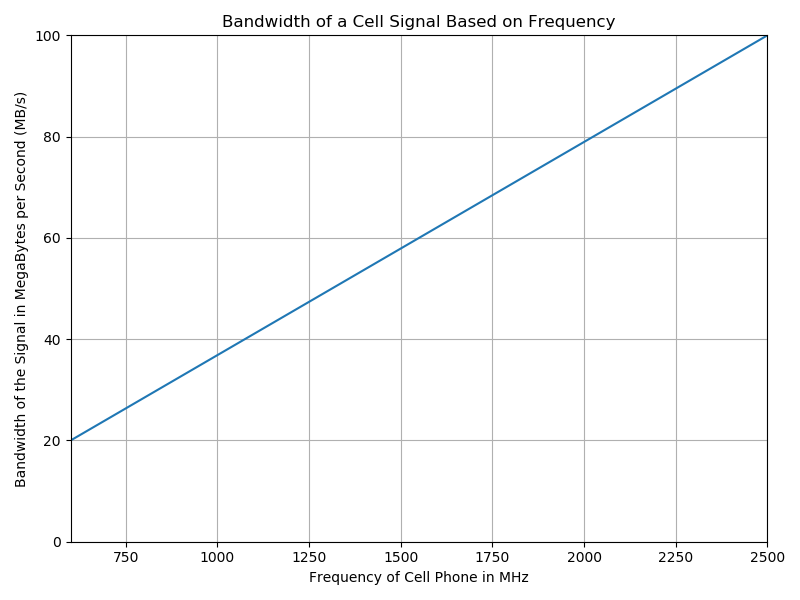

# Assessment
{: .no_toc }
The FCC just opened up some of the electro-magnetic spectrum for purchase.  You are fed up with the poor cell performance of todays carriers and so are going to propose a new cell carrier that fixes all of these problems.
However, because you are just a ninth grader, you are going to have to get some investors.
You have to prepare a proposal to give them so that you  can secure your funding.
Your proposal should focus on which frequency you are going to buy and why because that will be the single largest investment in your new company.

Your investors did NOT have nearly as awesome of a physical science class in high school so you are going to have to do some explaining to them in your proposal.
You should include:
  * Basic information of waves so that your investors can understand your reasoning.
  * Which frequency you are going to purchase and why.  
  * What sort of bandwidth you can expect (relative to other frequencies)
  * How well your phone will do in buildings (relative to other frequencies)

# Information
Use the following plots to help you make decisions as to which frequency you should choose.

<figure>

<figcaption>Absorption as a function of frequency.</figcaption>
</figure>
Remember if the signal is abosorbed by more walls, then you are going to have to have **MORE** towers to have the same coverage as you would if you had a signal that was absorbed less.

<figure>

<figcaption>Bandwidth as a function of frequency.</figcaption>
</figure>
Remember, if you you have less bandwidth, you will need **MORE** towers to get the same speed for everyone.

# Proficiency Scales
The main portion of your grade is based on your written portion.
How well you collect and cite information that you find elsewhere.
How well you VERIFY your information.

<figure>

<figcaption>Proficiency scale for Waves Assessment</figcaption>
</figure>